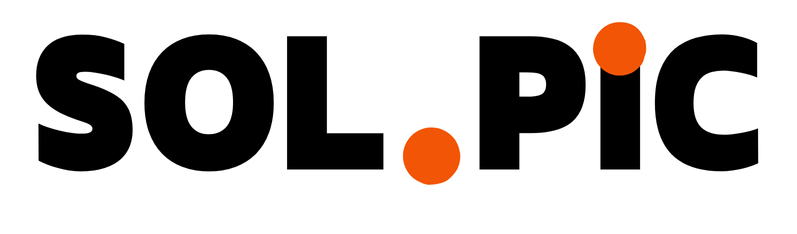

# 프로젝트 소개

  
   
  

    Sol.Pic(Solve Picture)은 수학문제 이미지를 AI 를 활용해 풀이과정과 정답을 제공해주는 모바일기반 어플리케이션 입니다.
  

  <a href="https://catnip-puppy-52c.notion.site/0f30ccd74be94f7cb0b00c4bca706361?pvs=4">해당노션 </a>
    ㅣ
  <a href="">서버 레포지토리</a>

## 분석과정

     

## 미리보기

  
  

## 기술 스택

**FrontEnd**

- React Native Expo
- Zustand
   

**BackEnd**

- FastAPI
- MongoDB

# 목차

<!-- toc -->

- [프로젝트 소개](#프로젝트-소개)
  - [분석과정](#분석과정)
  - [미리보기](#미리보기)
  - [기술스택](#기술-스택)
- [마주친 어려움](#%EB%A7%88%EC%A3%BC%EC%B9%9C-%EC%96%B4%EB%A0%A4%EC%9B%80)
  - [0. AI를 사용하여 어떻게 수학문제를 풀게 할까?](#0-ai%EB%A5%BC-%EC%82%AC%EC%9A%A9%ED%95%98%EC%97%AC-%EC%96%B4%EB%96%BB%EA%B2%8C-%EC%88%98%ED%95%99%EB%AC%B8%EC%A0%9C%EB%A5%BC-%ED%92%80%EA%B2%8C-%ED%95%A0%EA%B9%8C)
    - [0-1. 딥러닝 모델이 "사고"해서 수학문제를 풀 수 있을까?](#0-1-%EB%94%A5%EB%9F%AC%EB%8B%9D-%EB%AA%A8%EB%8D%B8%EC%9D%B4-%EC%82%AC%EA%B3%A0%ED%95%B4%EC%84%9C-%EC%88%98%ED%95%99%EB%AC%B8%EC%A0%9C%EB%A5%BC-%ED%92%80-%EC%88%98-%EC%9E%88%EC%9D%84%EA%B9%8C)
    - [0-2. 기존 AI는 어떤 과정으로 수학문제를 풀까?](#0-2-%EA%B8%B0%EC%A1%B4-ai%EB%8A%94-%EC%96%B4%EB%96%A4-%EA%B3%BC%EC%A0%95%EC%9C%BC%EB%A1%9C-%EC%88%98%ED%95%99%EB%AC%B8%EC%A0%9C%EB%A5%BC-%ED%92%80%EA%B9%8C)
  - [1. 수식으로 인한 이미지 분석(OCR) 과정의 어려움](#1-%EC%88%98%EC%8B%9D%EC%9C%BC%EB%A1%9C-%EC%9D%B8%ED%95%9C-%EC%9D%B4%EB%AF%B8%EC%A7%80-%EB%B6%84%EC%84%9Docr-%EA%B3%BC%EC%A0%95%EC%9D%98-%EC%96%B4%EB%A0%A4%EC%9B%80)
  - [2. 딥러닝 모델 적용까지 과정의 어려움](#2-%EB%94%A5%EB%9F%AC%EB%8B%9D-%EB%AA%A8%EB%8D%B8-%EC%A0%81%EC%9A%A9%EA%B9%8C%EC%A7%80-%EA%B3%BC%EC%A0%95%EC%9D%98-%EC%96%B4%EB%A0%A4%EC%9B%80)
    - [2-1. 딥러닝 모델을 만들어야할 지? vs 학습된 모델을 가져다 써야할 지?](#2-1-%EB%94%A5%EB%9F%AC%EB%8B%9D-%EB%AA%A8%EB%8D%B8%EC%9D%84-%EB%A7%8C%EB%93%A4%EC%96%B4%EC%95%BC%ED%95%A0-%EC%A7%80-vs-%ED%95%99%EC%8A%B5%EB%90%9C-%EB%AA%A8%EB%8D%B8%EC%9D%84-%EA%B0%80%EC%A0%B8%EB%8B%A4-%EC%8D%A8%EC%95%BC%ED%95%A0-%EC%A7%80)
  - [3. 딥러닝 모델 적용후 마주쳤던 어려움](#3-%EB%94%A5%EB%9F%AC%EB%8B%9D-%EB%AA%A8%EB%8D%B8-%EC%A0%81%EC%9A%A9%ED%9B%84-%EB%A7%88%EC%A3%BC%EC%B3%A4%EB%8D%98-%EC%96%B4%EB%A0%A4%EC%9B%80)
    - [3-1. 수학문제 해결 딥러닝 모델의 고성능 그래픽카드(GPU) 필요한 이유](#3-1-%EC%88%98%ED%95%99%EB%AC%B8%EC%A0%9C-%ED%95%B4%EA%B2%B0-%EB%94%A5%EB%9F%AC%EB%8B%9D-%EB%AA%A8%EB%8D%B8%EC%9D%98-%EA%B3%A0%EC%84%B1%EB%8A%A5-%EA%B7%B8%EB%9E%98%ED%94%BD%EC%B9%B4%EB%93%9Cgpu-%ED%95%84%EC%9A%94%ED%95%9C-%EC%9D%B4%EC%9C%A0)
    - [3-2. 고성능 GPU 없는 노트북 개발 환경에서 개발하기](#3-2-%EA%B3%A0%EC%84%B1%EB%8A%A5-gpu-%EC%97%86%EB%8A%94-%EB%85%B8%ED%8A%B8%EB%B6%81-%EA%B0%9C%EB%B0%9C-%ED%99%98%EA%B2%BD%EC%97%90%EC%84%9C-%EA%B0%9C%EB%B0%9C%ED%95%98%EA%B8%B0)
  - [4. 어떻게 딥러닝 모델 정확도를 향상시킬수 있을까?](#4-%EC%96%B4%EB%96%BB%EA%B2%8C-%EB%94%A5%EB%9F%AC%EB%8B%9D-%EB%AA%A8%EB%8D%B8-%EC%A0%95%ED%99%95%EB%8F%84%EB%A5%BC-%ED%96%A5%EC%83%81%EC%8B%9C%ED%82%AC%EC%88%98-%EC%9E%88%EC%9D%84%EA%B9%8C)
    - [4-1. 이미지 분석(OCR) 정확도 향상을 통한 방법](#4-1-%EC%9D%B4%EB%AF%B8%EC%A7%80-%EB%B6%84%EC%84%9Docr-%EC%A0%95%ED%99%95%EB%8F%84-%ED%96%A5%EC%83%81%EC%9D%84-%ED%86%B5%ED%95%9C-%EB%B0%A9%EB%B2%95)
    - [4-2. 딥러닝 모델 통한 정확도 향상](#4-2-%EB%94%A5%EB%9F%AC%EB%8B%9D-%EB%AA%A8%EB%8D%B8-%ED%86%B5%ED%95%9C-%EC%A0%95%ED%99%95%EB%8F%84-%ED%96%A5%EC%83%81)
- [진행 과정](#%EC%A7%84%ED%96%89-%EA%B3%BC%EC%A0%95)
- [느낀점](#%EB%8A%90%EB%82%80%EC%A0%90)

<!-- tocstop -->

# 마주친 어려움

> 생각해봤을때 **가장 어려웠던 점은** 프로젝트 규모에 비해 <U>**짧았던 프로젝트 기한(3주)**</U>이였습니다.

## 0. AI를 사용하여 어떻게 수학문제를 풀게 할까?

### 0-1. 딥러닝 모델이 "사고"해서 수학문제를 풀 수 있을까?

정답은 **"없다"** 입니다.

기존에 저희가 사용하는 AI 같은 경우 대규모 데이터를 기반으로 결과를 **추론** 하고 **학습** 하기 때문에 사고해서 수학문제를 풀게 할 수는 없습니다.

그러면 어떻게 수학문제를 풀 수 있게 할 수 있을까요?

### 0-2. 기존 AI는 어떤 과정으로 수학문제를 풀까?

기존 존재하는 서비스에서 AI가 수학문제를 풀 수 있는 것의 대한 해답은 **문제 전체** 를 구조화된 코드 형태로 바꾸는 것에 있습니다.

그렇게 구조화된 형태로 바뀐 수학문제들이 딥러닝 AI에 의해 각각 큰 문제 유형으로 분류되고 그 안에서 다시 세부적으로 분류되어서 유형화된 수학문제 풀이과정에서 과정과 정답을 기록해 두었다가 자연어 생성(NLG)과정을 거쳐서 사용자에게 보여주는 과정으로 이루어집니다.

  

## 1. 수식으로 인한 이미지 분석(OCR) 과정의 어려움

기존 사용하려던 이미지 분석(OCR) 같은 경우 텍스트에 대해서는 분석이 잘 되는 것을 살펴볼 수 있는데 수식같은 경우 분석이 잘 못하는 것을 살펴볼 수 있습니다.

   
 
 
   
 
그렇게 저는 <U>두 가지 방법</U>을 생각했습니다.

<U>처음 시도한 방법</U>은 수식 영역과 텍스트 영역을 분리(openCV 이용)해서 각각 분석을 시도한 결과 영역분리가 잘 안되었을 뿐더러 높은 러닝커브에 의해 아래와 같은 부실한 결과를 확인할 수 있습니다.
 

<U>제가 선택한 최종 방법은</U> 여러가지 수식 전용 외부 API 서비스를 비교해서 가장 정확히 분석을 해주는 API 서비스를 택했습니다.

 

위 그림과 같이 잘 나오는 것을 확인할 수 있습니다.

## 2. 딥러닝 모델 적용까지 과정의 어려움

### 2-1. 딥러닝 모델을 만들어야할 지? vs 학습된 모델을 가져다 써야할 지?

제가 선택한 방법은 **기존에 학습된 모델을 가져다 사용하는 방법**을 사용하기로 했습니다.
그렇게 선택한 이유는 2가지가 있습니다.

<U>첫번째</U> 딥러닝 모델을 만들기 위한 사전지식 부족.  
조사를 진행해보니 딥러닝 모델을 만들기 위해 높은 수준의 사전 지식이 필요하다는 것을 알게 되었고 해당 지식을 습득하기 위해선 많은 시간이 소요될 것이라고 판단을 했습니다.

<U>두번째</U> 학습시킬 데이터 양의 부족.  
원하는 기능을 가진 최소한의 딥러닝 모델을 만들기까지 필요한 데이터 양이 기능에 따라 달라질 수 있는데 수학문제를 풀 경우 최소 2000개 이상의 초기 데이터가 필요하기 때문에 무리가 있다고 판단을 했습니다.

위와 같은 이유로 이미 학습된 모델을 가져와 제가 원하는 방향으로 학습시키는 방법을 선택하게 되었고.  
그렇게 제가 사용한 모델은 **단순한 수학문제를 입력받아 풀이과정과 답을 도출해주는 AI 딥러닝 모델**을 사용하였습니다.  
여러가지 모델들을 비교했을때 해당 모델을 선택한 이유는 **풀이와 정답을 같이 반환해주기** 때문입니다.

## 3. 딥러닝 모델 적용후 마주쳤던 어려움

> 단순히 모델을 가져와 사용하는데 "어떤 어려움이 있을 수 있을까" 라는 생각을 하실 수 있지만 여러가지 어려움이 있을 수 있습니다.

### 3-1. 수학문제 해결 딥러닝 모델의 고성능 그래픽카드(GPU) 필요한 이유

수학문제를 풀어주는 딥러닝 모델을 사용하는데 가장 큰 어려움은 **그래픽카드(GPU)의 부재**였습니다.

그래픽카드가 필요한 이유는 2가지가 존재하는데

<U>첫번째 이유</U>로는 큰 규모의 딥러닝 모델(LLM)이 연산을 하는데 있어서 많은 양의 행렬 계산이 필요한데 해당 작업을 CPU 에서 수행할 경우 오랜 시간이 걸리는 한계가 발생할 수 있습니다. 이를 해결하기 위해 병렬작업에 특화된 GPU를 이용하여 연산시간을 크게 단축할 수 있기떄문입니다.

<U>두번째 이유</U>로는 큰 규모의 딥러닝 모델(LLM)을 학습, 훈련하는데 있어서 엄청난 수의 매개변수를 조정해야 하는데 이 역시도 병렬적으로 수행하여 시간을 크게 단축시킬 수 있기 때문에

위와 같은 이유로 수학문제를 풀어주고 계산과정을 저장할 수 있는 큰 규모의 모델이 필연적으로 필요하고 연산, 훈련 과정에 있어서 GPU가 필수로 필요한 이유입니다.

### 3-2. 고성능 GPU 없는 노트북 개발 환경에서 개발하기

[3-1.에서 설명했듯이](#3-1-수학문제-해결-딥러닝-모델의-고성능-그래픽카드gpu-필요한-이유) 해당 모델을 사용하기 위해 고성능 GPU 가 꼭 필요한 상황였는데 저의 개발환경 같은 경우 노트북이였기 때문에 수행할 만큼의 GPU 성능이 나오지 않았습니다.

이를 해결하기 위해 <U>2가지 방법</U>을 사용하였는데.

<U>첫번째</U> Google 에서 제공해주는 무료 클라우드 기반의 Python 개발 환경 'Colab'을 사용하여 해당 모델을 사용했을때 입력의 따른 출력을 받아와서 사용을 하였습니다.

 
 
 

<U>두번째</U> 로컬 서버를 인터넷에 공개할 수 있게 해주는 도구 'ngrok' 서비스를 이용하여 집에서 데스크탑을 이용해 서버를 작동시키는 방법을 통해서 해당 문제를 해결하였습니다.

 

## 4. 어떻게 딥러닝 모델 정확도를 향상시킬수 있을까?

> 해당 문제를 해결하기 위해 여러가지 방법을 사용하였습니다.

### 4-1. 이미지 분석(OCR) 정확도 향상을 통한 방법

이미지 분석(OCR)을 통한 정확도를 향상시키기 위해 저는 <U>2가지 방법</U>을 사용하였습니다.

<U>첫번째 방법</U>으로 좀 더 정확도 높은 외부API 서비스 변경

| 원본 사진                                                                                                                        | 변경 전                                                                                                                          | 변경 후                                                                                                                          |
| -------------------------------------------------------------------------------------------------------------------------------- | -------------------------------------------------------------------------------------------------------------------------------- | -------------------------------------------------------------------------------------------------------------------------------- |
|  |  |  |
|  |  |  |
|  |  |  |

위와 같이 원본 사진이 조금만 어둡거나 번호 관련해서 잘 인식하지 못하던 문제가 개선된 것을 살펴보실 수 있습니다.

<U>두번째 방법</U>으로 이미지 자르기 기능과 회전 기능을 추가하여 정확도를 향상시켰습니다.

| 이미지 자르기                                                                                                                    | 이미지 회전                                                                                                                                                                                                                                                       |
| -------------------------------------------------------------------------------------------------------------------------------- | ----------------------------------------------------------------------------------------------------------------------------------------------------------------------------------------------------------------------------------------------------------------- |
|  |   |

위 사진 처럼 이미지 자르기로 불필요한 부분을 제거해주고 똑바르지 못한 이미지 같은 경우 회전 기능을 추가해서 똑바르게 바꿔주어서 정확도를 향상 시키는 방법을 사용하였습니다.

이 이상으로 정확도를 향상시키려면 직접 이미지 분석(OCR) 기술을 배워 직접 이미지를 조작하고 편집해서 정확도를 향상시키는 방법도 있을 수 있을 것 같습니다.

### 4-2. 딥러닝 모델 통한 정확도 향상

딥러닝 모델을 통한 정확도를 향상시키는 방법으로 <U>2가지 방법</U>을 생각했습니다.

<U>첫번째 방법</U>으로 학습된 모델이기 때문에 사용 언어가 맞지않기 때문에 해당 특화 언어로 바꿔 주었습니다.  
제 모델같은 경우 영어, 중국어 특화 모델이기 때문에 이미지 분석(OCR)을 통한 결과를 영어로 바꿔주는 작업을 해주었습니다.

| 문제                                                                                                                             | 한글로 입력                                                                                                                      | 영어로 입력                                                                                                                      |
| -------------------------------------------------------------------------------------------------------------------------------- | -------------------------------------------------------------------------------------------------------------------------------- | -------------------------------------------------------------------------------------------------------------------------------- |
|  |  |  |

위 결과를 살펴보면 "boxed{}" 에 결과값이 나오는데 한글로 입력했을시 "5" 라는 이상한 답이 나오고 영어로 입력했을 시 정상적으로 "0.5(1/2)" 값이 나온것을 살펴볼 수 있습니다.  
이렇게 해당 모델에 입력하기 전에 영어로 바꿔주는 과정을 거쳐서 정확도를 향상시키는 방법을 사용하였습니다.

<U>두번재 방법</U>으로 딥러닝의 특징중 하나인 학습을 활용해서 정확도를 향상시키는 방법을 사용하였습니다.

(보완 예정)

<!--
(예정)

4-2. 딥러닝 모델 학습을 통한 정확도 향상

5. 수식으로 인한 문제점

- AI에서 반환된 영어풀이 번역시 문제
- Expo 에서 렌더링시 문제

6. 문제풀이 분석시 요청응답 시간 최적화

- 폴링
- 서브서버 구현
- 다른 페이지로 이동가능
- OCR 미리 요청

7. 이미지 데이터 관련 처리

- 데이터베이스 관리
- 이미지 상태관리
- 메인페이지 이미지들 렌더링 -->

# 진행 과정

총 프로젝트 기간: 9월 2일 ~ 10월 2일 (대략 4주)

- 1주차

  - 아이디어 선정
  - 선정된 아이디어 기술 스택 결정 및 검증

- 2주차

  - Expo 이용한 새로운 플랫폼(모바일) 정적페이지 구현
  - 이미지 분석(OCR) 기술 구현가능 여부 판단(조사, 시도) -> API 사용으로 결론
  - 딥러닝 모델 구현가능 여부 판단(조사, 시도) -> 학습된 딥러닝 모델 가져오기로 결론

- 3주차

  - 프로젝트에 적합한 이미지 분석(OCR) API 탐색 및 적용
  - 프로젝트에 적합한 딥러닝 모델 탐색 및 적용

- 4주차
  - 새로운 환경(FastAPI)서버 CRUD 구현
  - 클라이언트측 UI, UX 구현
  - GPU로 부재로 인한 집에서 서버 연결(조사, 시도)
  - 상호연결에 의한 에러처리

# 느낀점

해당 주제로 프로젝트를 시작하였을때 가장 크게 걱정했던 점은 총 두 가지였습니다.

첫째. 시중에 나온 기존 서비스들도 완벽하게 풀어내지 못하고, 딥러닝 AI를 통해 이를 해결 하는 것이 엄청 어렵다는 것을 알게 되면서 "과연 내가 잘 해낼수 있을까?"라는 불안감이 들었습니다.

둘째. 프로젝트를 완성하기 위해 OCR, 딥러닝, 새로운 플랫폼과 언어 등 많은 새로운 기술을 배워야 했고, 이를 짧은 시간(3주) 안에 적용해야 한다는 점에서 부담을 느꼈습니다.

그렇게 프로젝트를 진행하면서 여러 기술을 적용하기 위한 다양한 시도를 했었고, 그 결과 잘 배워서 적용한 기술들도 있는 반면 단기간에 배우기에 어려운 기술같은 경우(OCR) 외부 API 나 라이브러리를 활용하게 되었습니다.

이를 통해 기한내 프로젝트를 완성 시키는 **책임감**과 웹개발자의 **역할**에 대해서 생각해보고 배울수 있는 계기가 되었던 프로젝트였다고 생각했습니다.
